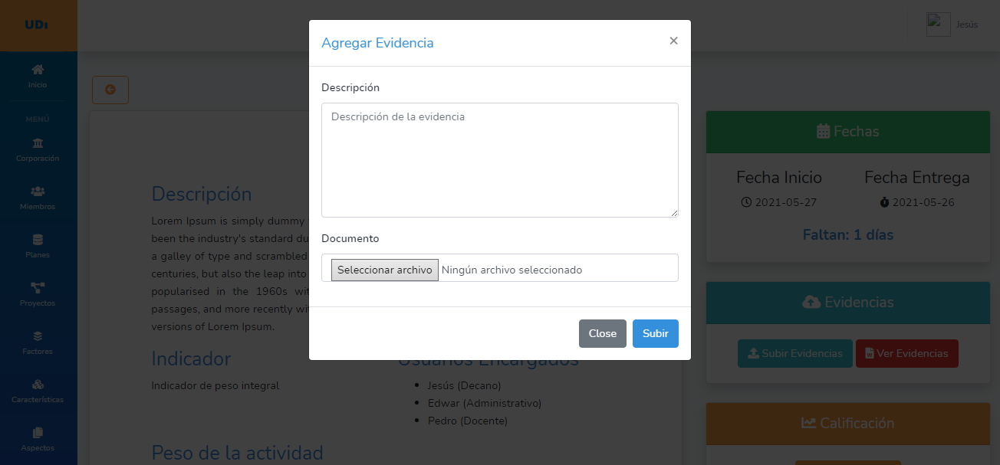
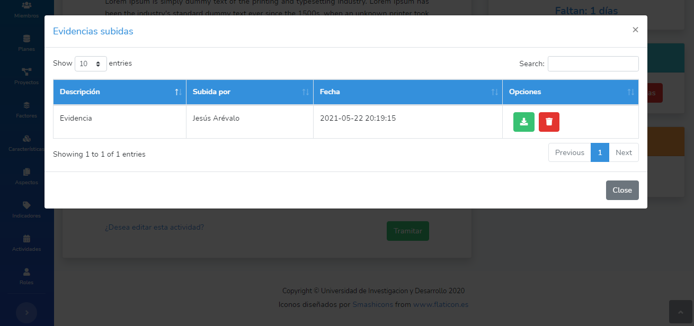
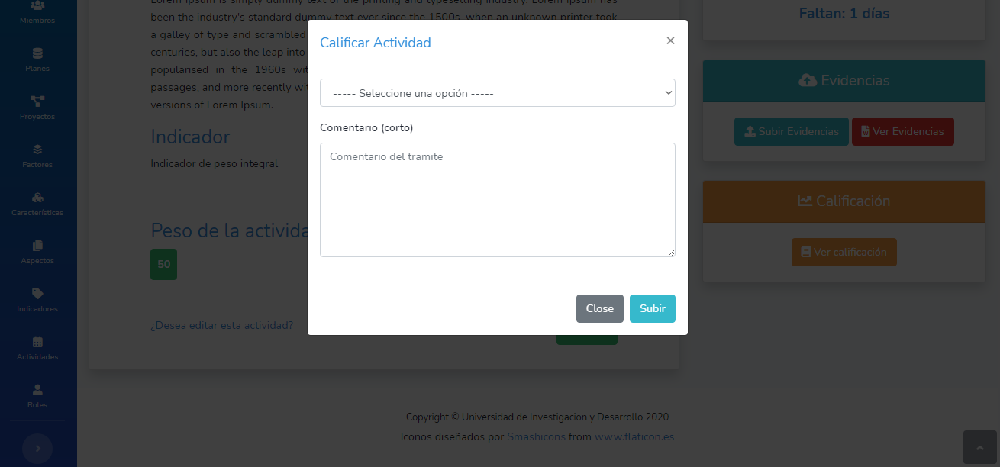

# Proyecto de grado Ingeniería de sistemas

Prototipo de software para documentar las evidencias de las actividades del plan de mejoramiento para el programa de Ingeniería de Sistemas.

## Funcionalidades

- CRUD de los usuarios
- Modificacion de perfil
- Inicio de Sesión
- Recuperacion de Contraseña
- CRUD de los planes de mejoramiento
- CRUD de los proyectos que corresponden a esos planes
- CRUD de los factores
- CRUD de las características
- CRUD de los aspectos
- CRUD de los indicadores
- CRUD de las actividades
- Manejo de evidencias (Subir y descargar evidencias)
- Tramitar actividades (Avalar o rechazar) según sea el caso
- Llevar calculo del progreso de cada relación para así saber el progreso que tiene el plan

## Preview

Algunas de las paginas principales:

`Bienvenida`

***

`Login`

***

`Inicio`

***

`Subir Evidencias`

***

`Ver Evidencias`

***

`Tramitar Actividad`

## Creado

Universidad de Investigación y Desarrollo - UDI.
