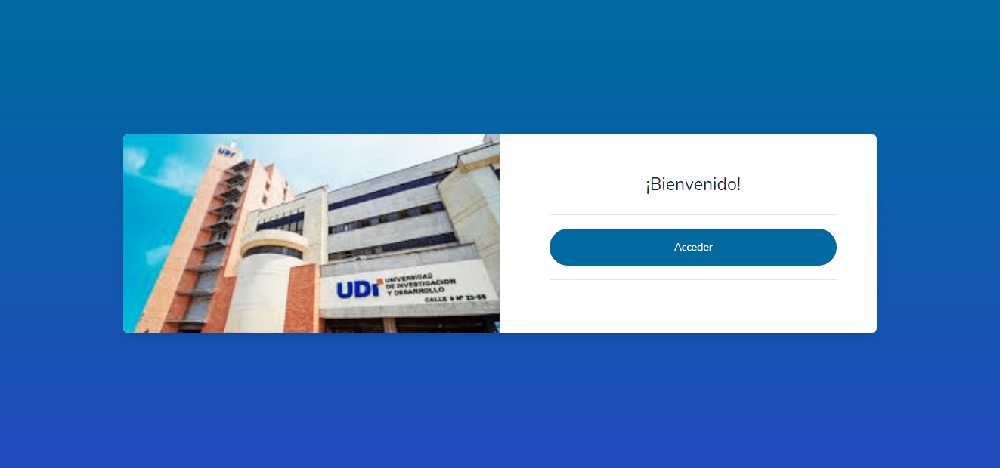
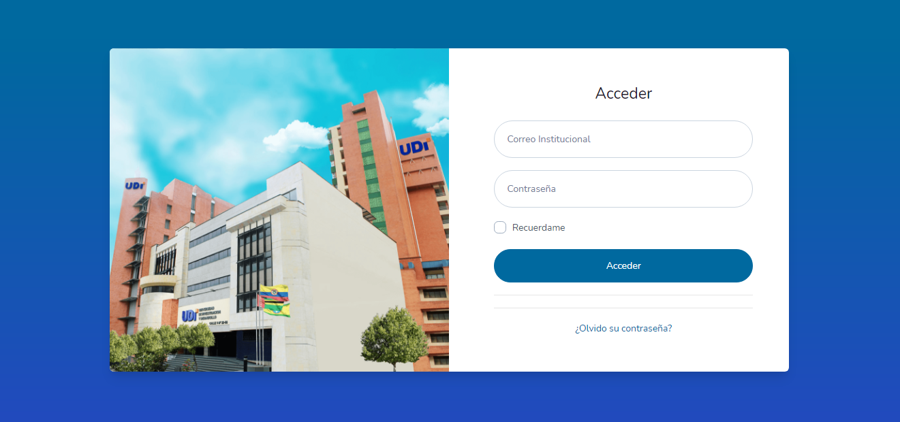
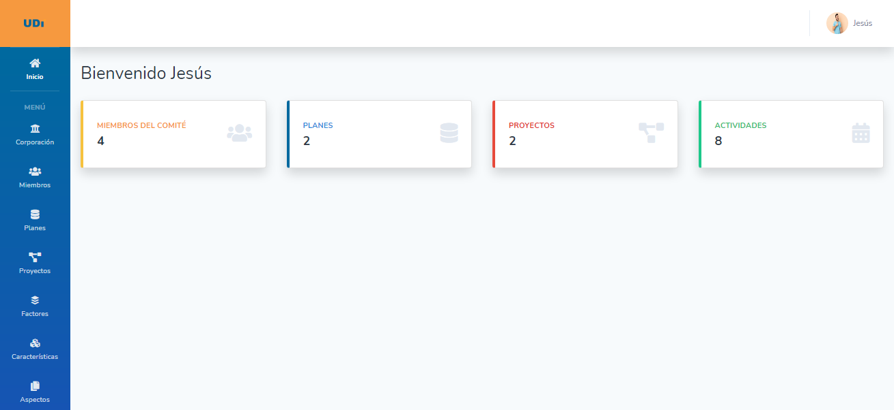
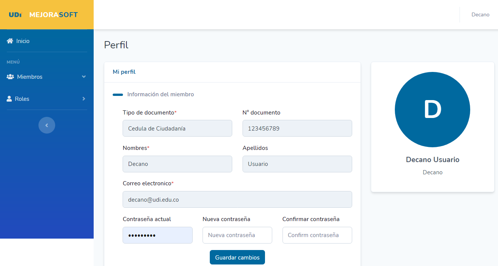

# Primera versión del prototipo software para plan de mejoramiento

Prototipo de software para documentar las evidencias de las actividades del plan de mejoramiento para el programa de Ingeniería de Sistemas.

## Funcionalidades

- CRUD de los usuarios
- Modificacion de perfil
- Inicio de Sesión
- Recuperacion de Contraseña

## Preview

Algunas de las paginas principales:

`Bienvenida`

***

`Login`

***

`Inicio`

***

`Perfil`

## Creado

Universidad de Investigación y Desarrollo - UDI.
